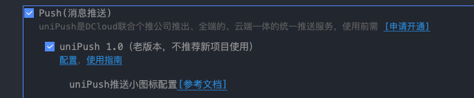
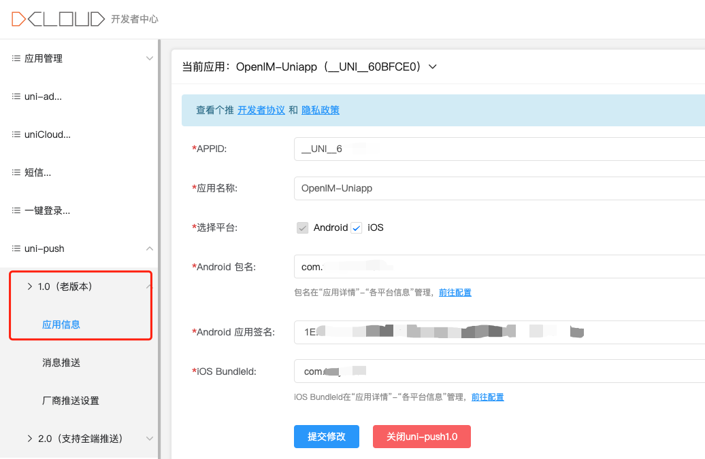
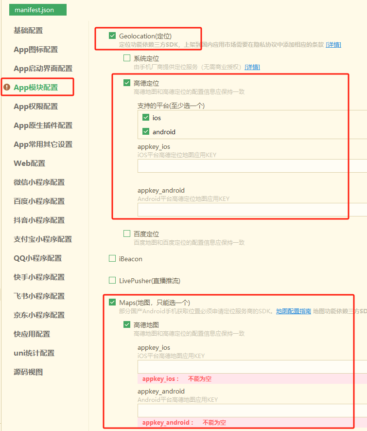

# 常见功能配置指南

- [离线推送功能](#离线推送功能)
- [地图功能](#地图功能)

## 离线推送功能

目前使用的 uni-push 1.0

### 客户端配置

#### 1. 使用 uni-push 1.0

- Hbuilder 打开 manifest.json 勾选 Push

  

- dcloud 开发者中心开启 uni-push 1.0 并填写相关信息

  

### 离线推送横幅设置

目前SDK的设计是直接由客户端控制推送横幅的展示内容。发送消息时，设置入参 [offlinePushInfo](https://github.com/openimsdk/open-im-uniapp-demo/blob/main/pages/conversation/chating/components/ChatingFooter/index.vue#L449)：

```js
  export const offlinePushInfo = {
    title: "you have a new message",
    desc: "you have a new message",
    ex: "",
    iOSPushSound: "",
    iOSBadgeCount: true,
  };
  // 如果不自定义 offlinePushInfo，则title 默认为 ap p名称，desc 默认为为“你收到了一条新消息”
```

根据实际需求，完成对应的客户端和服务端配置后即可启用离线推送功能。

---

## 地图功能

### 配置指南

1. 需要配置对应的 AMap Key。具体请参考 [AMap 文档](https://lbs.amap.com/)

- 需要申请 *Web服务*、*Android平台*、*iOS平台* key

2. 修改 common/config 文件

-  **[配置 Web服务 key](https://github.com/openimsdk/open-im-uniapp-demo/blob/main/common/config.js#L14)**

3. 使用 Hbuilder 打开 manifest.json 配置 *Android平台* 和 *iOS平台* key

  

完成配置后即可启用地图功能。
