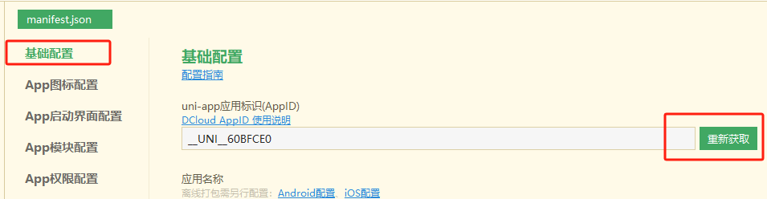
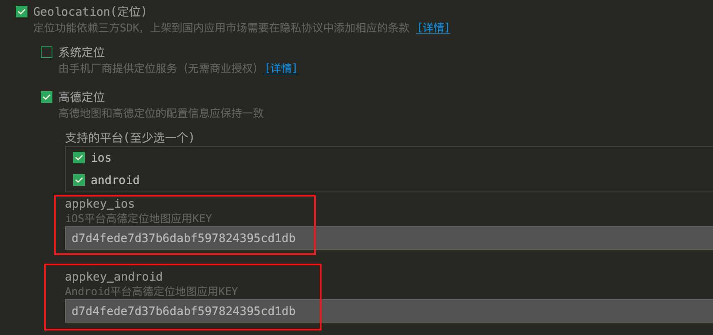
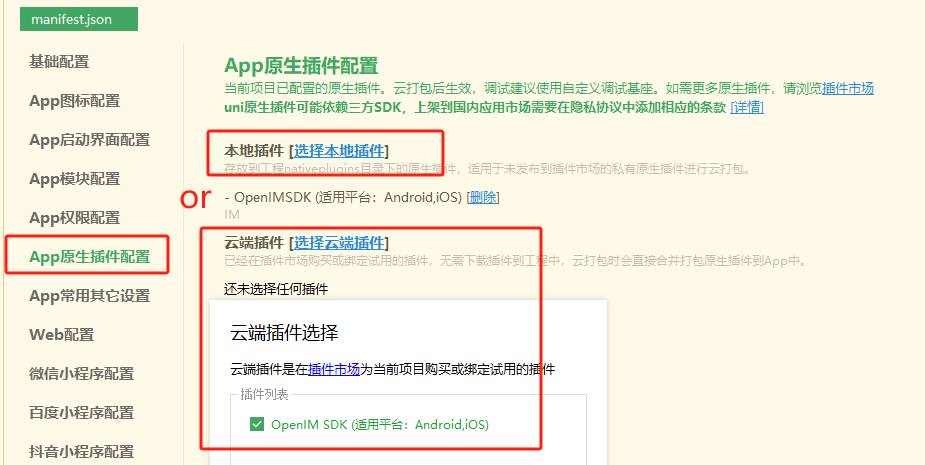
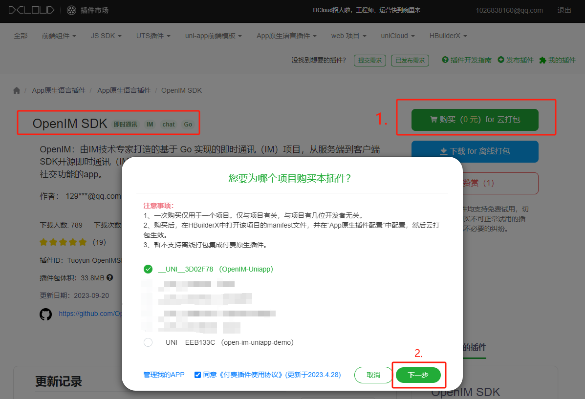
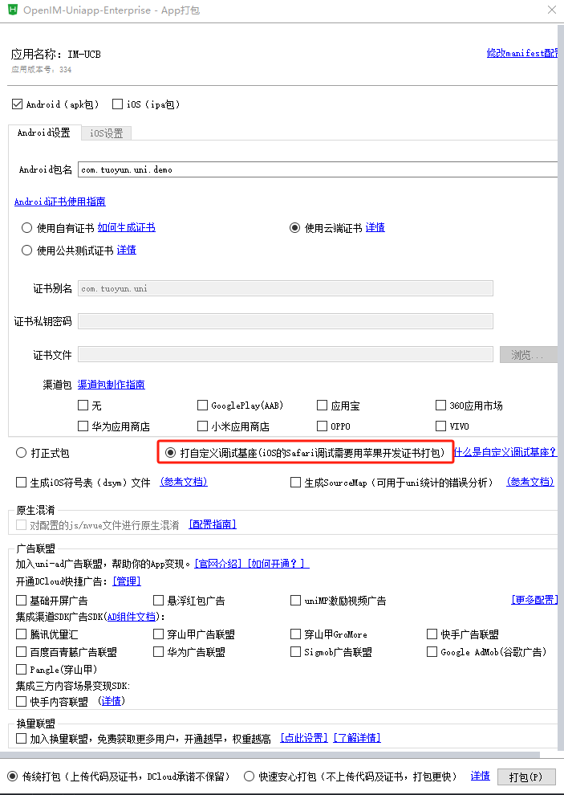
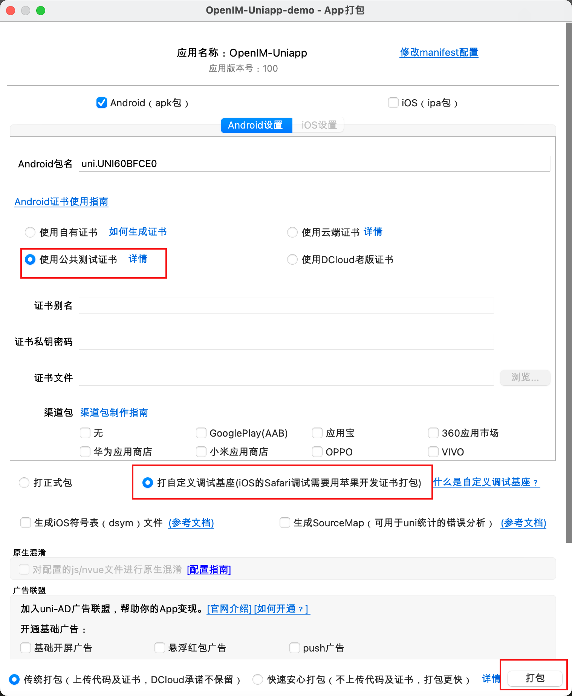

<p align="center">
    <a href="https://www.openim.online">
        
    </a>
</p>

# OpenIM Uniapp Demo 💬

<p>
  <a href="https://doc.rentsoft.cn/">OpenIM Docs</a>
  •
  <a href="https://github.com/openimsdk/open-im-server">OpenIM Server</a>
  •
  <a href="https://github.com/openimsdk/open-im-sdk-uniapp">open-im-sdk-uniapp</a>
  •
  <a href="https://github.com/openimsdk/openim-sdk-core">openim-sdk-core</a>
</p>

<br>

OpenIM Uniapp Demo 是一个基于本地插件、OpenIM Server 和 Uniapp 的开源即时通讯应用程序。它演示了如何使用 OpenIM 将即时消息功能快速集成到任何单一应用程序中。

您可以通过以下两种方式之一，获得使用源代码创建非由OpenIM生成的编译版本的许可：
1. 根据自由软件基金会的GPL v.3.0许可，受此政策概述的例外情况的限制；或
2. 通过与OpenIM联系（contact@openim.io）获取商业许可。

## 技术栈 🛠️

- 这是一个 [Uniapp](https://uniapp.dcloud.net.cn/) 项目， 依赖于 [HBuilderX](https://www.dcloud.io/hbuilderx.html) 。开发前请先阅读 [文档](https://docs.openim.io/zh-Hans/sdks/quickstart/uniapp)。

- 注意：Demo 只是用于演示 SDK 的引入与使用，并不是不是一个完整的应用。

- 运行 iOS 和 Android **必须**安装原生插件，中间层 `openim-uniapp-polyfill` 结合 App 原生插件和 JSSDK 能力，兼容一套代码同时开发 APP、H5、小程序（ SDK 和 im-server 版本 >= 3.8.2 ）。

<table>
  <tr>
    <th style="text-align: center;">-</th>
    <th style="text-align: center;">安装 openim-uniapp-polyfill</th>
    <th style="text-align: center;">安装 @openim/client-sdk</th>
    <th style="text-align: center;">安装 App原生插件</th>
    <th style="text-align: center;">制作自定义基座调试</th>
  </tr>
  <tr>
    <td style="text-align: center;">仅开发H5、小程序</td>
    <td style="text-align: center;" colspan="5">直接参考 <a href="https://docs.openim.io/zh-Hans/sdks/quickstart/miniProgram">JSSDK 文档<a>，SDK 调用参考 Browser、MiniProgram </td>
  </tr>
  <tr>
    <td style="text-align: center;">仅开发App端</td>
    <td style="text-align: center;">✅</td>
    <td style="text-align: center;">❌</td>
    <td style="text-align: center;">✅</td>
    <td style="text-align: center;">✅</td>
  </tr>
  <tr>
    <td style="text-align: center;">同时开发App端、H5和小程序</td>
    <td style="text-align: center;">✅</td>
    <td style="text-align: center;">✅</td>
    <td style="text-align: center;">✅</td>
    <td style="text-align: center;">✅</td>
  </tr>
</table>

## 本地开发 🛠️

按照以下步骤设置本地开发环境 :

1. 安装最新的正式版 [HBuilderX](https://www.dcloud.io/hbuilderx.html)。

2. 运行 `npm install` 安装所有依赖项。

3. 在以下文件中将配置文件修改为您自己的 AppID :
    > 使用 Hbuilder 打开 manifest.json

    

4. 如果你想使用定位功能，在以下文件中将配置文件修改为您自己的高德地图 appkey :
   > 使用 Hbuilder 打开 manifest.json

    

5. 在以下文件中将请求地址修改为您自己的OpenIM Server IP:
   > 注意: 需要先 [部署](https://github.com/openimsdk/open-im-server#rocket-quick-start) OpenIM Server, OpenIM Server 默认端口为 10001、10002、10008。
   - `common -> config.js`

     ```js
      const wsUrl = "ws://your-server-ip:10001"
      const apiUrl = "http://your-server-ip:10002"
      const registerUrl = "http://your-server-ip:10008"
     ```

6. 选择云插件 (必须)

    

    > 选择云插件需要选择您的项目 Appid 和输入 Android 包名称。

    

7. 云打包自定义调试基座

  - 菜单 -> 运行 -> 运行到手机或模拟器 -> 制作自定义调试基座

  
  

8. 在真实的机器或模拟器上运行 （ iOS 仅支持在真机调试 ）

  - 菜单 -> 运行 -> 运行到手机或模拟器 -> 运行到Android App基座

  

## 打包发布 🚀

### 使用原生App 云打包

  - 菜单 -> 发行 -> 原生App-云打包

  


## 社区参与 :busts_in_silhouette:

- 📚 [OpenIM 社区](https://github.com/OpenIMSDK/community)
- 💕 [OpenIM 兴趣小组](https://github.com/Openim-sigs)
- 🚀 [加入我们的Slack社区](https://join.slack.com/t/openimsdk/shared_invite/zt-2ijy1ys1f-O0aEDCr7ExRZ7mwsHAVg9A)
- :eyes: [加入我们的微信社区](https://openim-1253691595.cos.ap-nanjing.myqcloud.com/WechatIMG20.jpeg)

## 社区会议 :calendar:

我们希望任何人都能参与到我们的社区并贡献代码，我们提供礼物和奖励，我们欢迎您每周四晚上加入我们。

我们的会议在 [OpenIM Slack](https://join.slack.com/t/openimsdk/shared_invite/zt-2ijy1ys1f-O0aEDCr7ExRZ7mwsHAVg9A) 🎯, 然后你可以搜索 Open-IM-Server 频道加入。

我们把每一次 [双周会](https://github.com/orgs/OpenIMSDK/discussions/categories/meeting) 记录在 [GitHub discussions](https://github.com/openimsdk/open-im-server/discussions/categories/meeting), 我们的历史会议记录以及会议回放可以在 [Google Docs :bookmark_tabs:](https://docs.google.com/document/d/1nx8MDpuG74NASx081JcCpxPgDITNTpIIos0DS6Vr9GU/edit?usp=sharing)。

## 谁在使用OpenIM :eyes:

查看我们的 [用户案例研究](https://github.com/OpenIMSDK/community/blob/main/ADOPTERS.md) 页面以获取项目用户列表。 不要犹豫，留下 [评论](https://github.com/openimsdk/open-im-server/issues/379) 并分享您的用例。

## 授权许可 :page_facing_up:

本仓库采用 GNU Affero 通用公共许可证第3版 (AGPL-3.0) 进行许可，并受以下附加条款的约束。不允许用于商业用途。详情请参阅 [此处](./LICENSE)。
