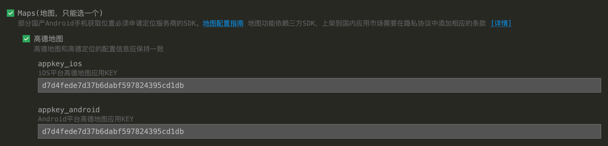
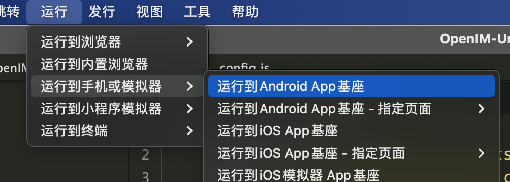
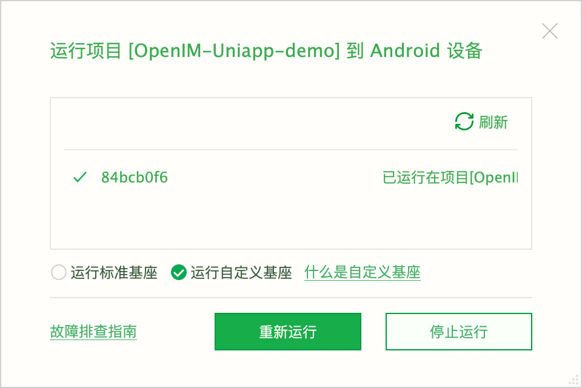

## 仅供学习使用，非授权请勿商业用途，违者必究

## 安装依赖

项目根目录命令行执行:

```bash
npm install
```

或

```bash
yarn
```


## 修改配置

### manifest.json

- 重新获取AppID

  

- 修改高德地图appkey (如果要使用定位功能)，应用中配置的key已绑定包名`com.tuoyun.uni`。如有需要  请自行前往高德开放平台获取。

  

  


### common->config.js

- https+域名形式,nginx[配置可参考](https://doc.rentsoft.cn/#/v2/server_deploy/easy_deploy_new?id=%e4%ba%94%e3%80%81nginx%e9%85%8d%e7%bd%ae%e5%8f%82%e8%80%83)。若按照官方nginx方式配置。则仅需要修改下方域名为你自己的域名即可，后缀保留。

  ```javascript
  registerUrl: 'https://web.rentsoft.cn/chat'
  apiUrl: 'https://web.rentsoft.cn/api'
  wsUrl: 'wss://web.rentsoft.cn/msg_gateway'
  ```

- http+IP+端口形式 仅需替换IP即可。**不必更换端口**

  ```javascript
  registerUrl: 'http://121.5.182.23:10008'
  apiUrl: 'http://121.5.182.23:10002'
  wsUrl: 'ws://121.5.182.23:10001'
  ```

- 高德地图web api key  用于根据经纬度生成快照  需要自行申请替换

  ```javascript
  AmapWebKey: ''
  ```

- 图片、视频等资源文件存储方式  支持minio cos oss  推荐minio、cos

  ```javascript
  objectStorage: 'minio'
  ```


## 云打包自定义调试基座

> 推荐环境：Hbuilder X 3.6.5.20221121
>
> 由于demo是基于原生插件开发的，所以**仅支持 Android、iOS**运行。且根据uniapp官方文档，调试原生插件需要先打包自定义基座，在**自定义基座**上运行。

- 菜单栏->发行->原生App 云打包

  

- 等待云打包完成后运行自定义调试基座到模拟器或真机。

  > 菜单栏->运行->运行到 App基座

  

  
