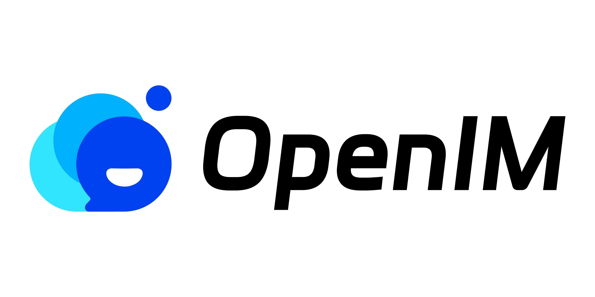
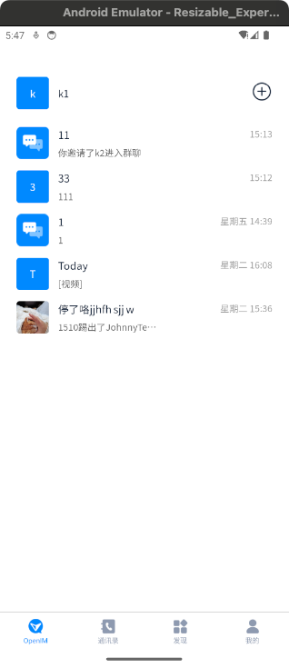
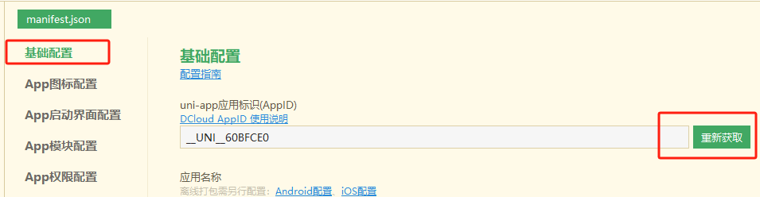
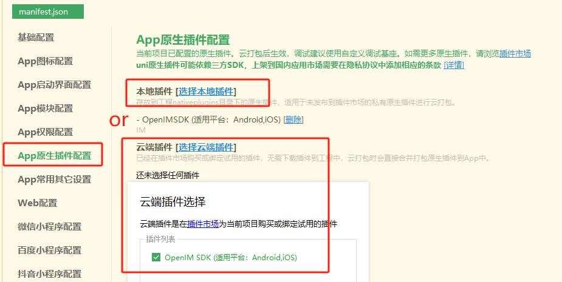
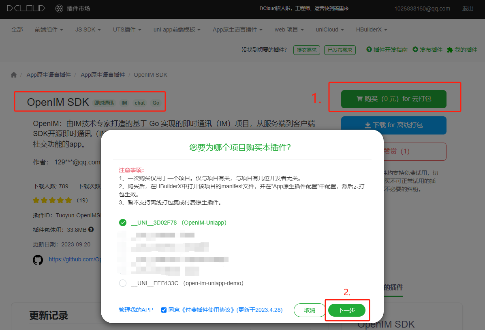
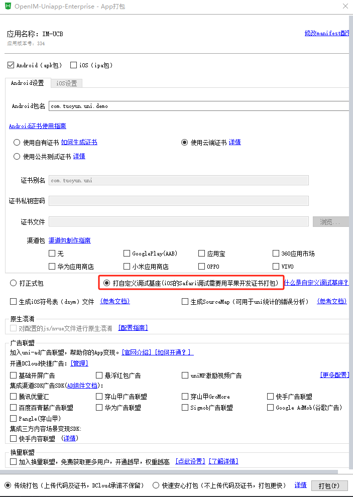
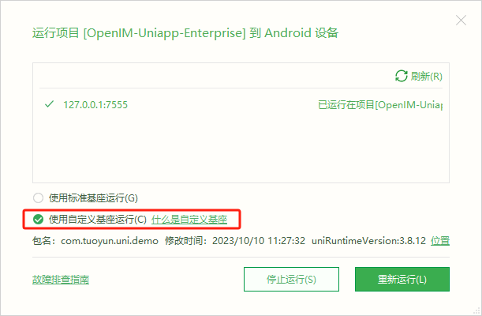
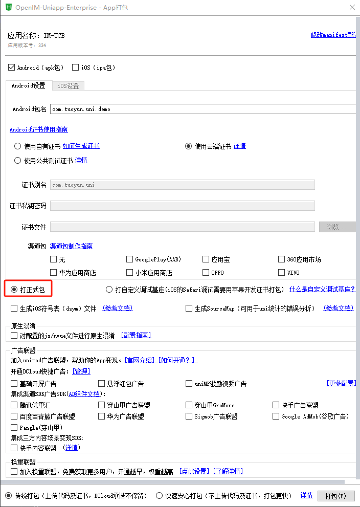

<p align="center">
    <a href="https://openim.io">
        
    </a>
</p>

# OpenIM Uniapp 💬💻

<p>
  <a href="https://docs.openim.io/">OpenIM Docs</a>
  •
  <a href="https://github.com/openimsdk/open-im-server">OpenIM Server</a>
  •
  <a href="https://github.com/openimsdk/open-im-sdk-uniapp">open-im-sdk-uniapp</a>
  •
  <a href="https://github.com/openimsdk/openim-sdk-core">openim-sdk-core</a>
</p>
OpenIM 为开发者提供开源即时通讯 SDK，作为 Twilio、Sendbird 等云服务的替代方案。借助 OpenIM，开发者可以构建安全可靠的即时通讯应用，如 WeChat、Zoom、Slack 等。

本仓库基于开源版 OpenIM SDK 开发，提供了一款基于 uniapp 的即时通讯应用。您可以使用此应用程序作为 OpenIM SDK 的参考实现。本项目引用了 `openim-uniapp-polyfill`，可以构建安卓程序和 iOS 程序。

<p align="center">
   
   <span style="display: inline-block; width: 16px;"></span>
   
</p>

## 授权许可 :page_facing_up:

本仓库采用 GNU Affero 通用公共许可证第 3 版 (AGPL-3.0) 进行许可，并受以下附加条款的约束。**不允许用于商业用途**。详情请参阅 [此处](./LICENSE)。

## 开发环境

在开始开发之前，请确保您的系统已安装以下软件：

- **HBuilderX**：4.45(4.55官方目前有[Bug](https://ask.dcloud.net.cn/question/206506))
- **Node.js**：版本 ≥ 16.x（[手动安装](https://nodejs.org/dist/latest-v20.x/) 或使用 [nvm](https://github.com/nvm-sh/nvm) 进行版本管理）
- **npm**：版本 ≥ 6.x（随 Node.js 一起安装）
- **Git**：用于代码版本控制

同时，您需要确保已经[部署](https://docs.openim.io/zh-Hans/guides/gettingStarted/dockerCompose)了最新版本的 OpenIM Server。接下来，您可以编译项目并连接自己的服务端进行测试。

## 运行环境

本应用支持以下操作系统版本：

| 浏览器/操作系统 | 版本              | 状态 |
| --------------- | ----------------- | ---- |
| **iOS**         | 13.0 及以上        | ✅   |
| **Android**     | 24 及以上          | ✅   |

### 说明

- `只支持` Uniapp 打包成 Android/iOS 应用。并且 SDK 也暂未支持 UniappX （开发中）。
- 暂时 `不支持` 运行到 Web，如果需要移动端的 Web 项目，参考 [H5 demo](https://github.com/openimsdk/openim-h5-demo)。
- 暂时 `不支持` 运行到小程序端。
- 暂时 `不支持` 一对一音视频。如果需要使用，可以运行其他仓库的项目。

## 快速开始

按照以下步骤设置本地开发环境：

1. 拉取代码

   ```bash
   git clone https://github.com/openimsdk/open-im-uniapp-demo.git
   cd open-im-uniapp-demo
   ```

2. 安装依赖

   ```bash
   npm install
   ```

3. 修改配置

   - `common/config.js`

     > 如果没有修改过服务端默认端口，则只需要修改`BASE_HOST`为您的服务器 ip 即可，如需配置域名和 https 访问，可以参考[nginx 配置](https://docs.openim.io/zh-Hans/guides/gettingStarted/nginxDomainConfig)，并采用最下方的配置项，并修改`BASE_DOMAIN`为您的域名。

     ```javascript
     const BASE_HOST = 'your-server-ip'
     const CHAT_URL = `http://${BASE_HOST}:10008`
     const API_URL = `http://${BASE_HOST}:10002`
     const WS_URL = `ws://${BASE_HOST}:10001`

     // const BASE_DOMAIN = 'your-server-domain'
     // const CHAT_URL = `http://${BASE_DOMAIN}/chat`
     // const API_URL = `http://${BASE_DOMAIN}/api`
     // const WS_URL = `ws://${BASE_DOMAIN}/msg_gateway`
     ```

4. 修改为您自己的 AppID

- 使用 Hbuilder 打开 manifest.json

  

5. 导入原生插件

- 使用 Hbuilder 打开 manifest.json

  

- 选择云插件需要选择您的项目 Appid 和输入 Android 包名称

  

6. 云打包自定义调试基座

- 菜单 -> 运行 -> 运行到手机或模拟器 -> 制作自定义调试基座 (使用自己的包名)

  

7. 在真实的机器或模拟器上运行 （ iOS 仅支持在真机调试 ）

- 菜单 -> 运行 -> 运行到手机或模拟器 -> 运行到Android App基座

  

8. 开始开发测试！ 🎉

## 音视频通话

一对一音视频通话，多人音视频通话、视频会议请联系邮箱 [contact@openim.io](mailto:contact@openim.io)

## 构建 🚀

### 使用原生App 云打包

- 菜单 -> 发行 -> 原生App-云打包

  

## 功能列表

### 说明

| 功能模块           | 功能项                                                    | 状态 |
| ------------------ | --------------------------------------------------------- | ---- |
| **账号功能**       | 手机号注册\邮箱注册\验证码登录                            | ✅   |
|                    | 个人信息查看\修改                                         | ✅   |
|                    | 修改密码\忘记密码                                         | ✅   |
| **好友功能**       | 查找\申请\搜索\添加\删除好友                              | ✅   |
|                    | 同意\拒绝好友申请                                         | ✅   |
|                    | 好友备注                                                  | ✅   |
|                    | 是否允许添加好友                                          | ✅   |
|                    | 好友列表\好友资料实时同步                                 | ✅   |
| **黑名单功能**     | 限制消息                                                  | ✅   |
|                    | 黑名单列表实时同步                                        | ✅   |
|                    | 添加\移出黑名单                                           | ✅   |
| **群组功能**       | 创建\解散群组                                             | ✅   |
|                    | 申请加群\邀请加群\退出群组\移除群成员                     | ✅   |
|                    | 群名/群头像更改/群资料变更通知和实时同步                  | ✅   |
|                    | 群成员邀请进群                                            | ✅   |
|                    | 群主转让                                                  | ✅   |
|                    | 群主、管理员同意进群申请                                  | ✅   |
|                    | 搜索群成员                                                | ✅   |
| **消息功能**       | 离线消息                                                  | ✅   |
|                    | 漫游消息                                                  | ✅   |
|                    | 多端消息                                                  | ✅   |
|                    | 历史消息                                                  | ✅   |
|                    | 消息删除                                                  | ✅   |
|                    | 消息清空                                                  | ✅   |
|                    | 消息复制                                                  | ✅   |
|                    | 单聊正在输入                                              | ✅   |
|                    | 新消息勿扰                                                | ✅   |
|                    | 清空聊天记录                                              | ✅   |
|                    | 新成员查看群聊历史消息                                    | ✅   |
|                    | 新消息提示                                                | ✅   |
|                    | 文本消息                                                  | ✅   |
|                    | 图片消息                                                  | ✅   |
|                    | 视频消息                                                  | ✅   |
|                    | 表情消息                                                  | ✅   |
|                    | 文件消息                                                  | ✅   |
|                    | 语音消息                                                  | ✅   |
|                    | 名片消息                                                  | ✅   |
|                    | 地理位置消息                                              | ✅   |
|                    | 自定义消息                                                | ✅   |
| **会话功能**       | 置顶会话                                                  | ✅   |
|                    | 会话已读                                                  | ✅   |
|                    | 会话免打扰                                                | ✅   |
| **REST API**       | 认证管理                                                  | ✅   |
|                    | 用户管理                                                  | ✅   |
|                    | 关系链管理                                                | ✅   |
|                    | 群组管理                                                  | ✅   |
|                    | 会话管理                                                  | ✅   |
|                    | 消息管理                                                  | ✅   |
| **Webhook**        | 群组回调                                                  | ✅   |
|                    | 消息回调                                                  | ✅   |
|                    | 推送回调                                                  | ✅   |
|                    | 关系链回调                                                | ✅   |
|                    | 用户回调                                                  | ✅   |
| **容量和性能**     | 1 万好友                                                  | ✅   |
|                    | 10 万人大群                                               | ✅   |
|                    | 秒级同步                                                  | ✅   |
|                    | 集群部署                                                  | ✅   |
|                    | 互踢策略                                                  | ✅   |
| **在线状态**       | 所有平台不互踢                                            | ✅   |
|                    | 每个平台各只能登录一个设备                                | ✅   |
|                    | PC 端、移动端、Pad 端、Web 端、小程序端各只能登录一个设备 | ✅   |
|                    | PC 端不互踢，其他平台总计一个设备                         | ✅   |
| **文件类对象存储** | 支持私有化部署 minio                                      | ✅   |
|                    | 支持 COS、OSS、Kodo、S3 公有云                            | ✅   |
| **推送**           | 消息在线实时推送                                          | ✅   |
|                    | 消息离线推送，支持个推，Firebase                          | ✅   |

更多高级功能、音视频通话、视频会议 请联系邮箱 [contact@openim.io](mailto:contact@openim.io)

## 加入社区 :busts_in_silhouette:

- 🚀 [加入我们的 Slack 社区](https://join.slack.com/t/openimsdk/shared_invite/zt-22720d66b-o_FvKxMTGXtcnnnHiMqe9Q)
- :eyes: [加入我们的微信群](https://openim-1253691595.cos.ap-nanjing.myqcloud.com/WechatIMG20.jpeg)

## 常见问题

1. 直接运行无法使用？

   答：必须严格按照文档操作，导入原生插件和制作自定义基座才能运行。

2. iOS 制作自定义基座失败？

   答：插件源码不能经过其他操作系统。只能在 MacOS 环境下载插件、制作自定义基座和云打包。

3. 如何使用地图、定位?
  答： [参考文档](CONFIGKEY.md)

4. 如何使用离线推送?
  答： [参考文档](CONFIGKEY.md)
